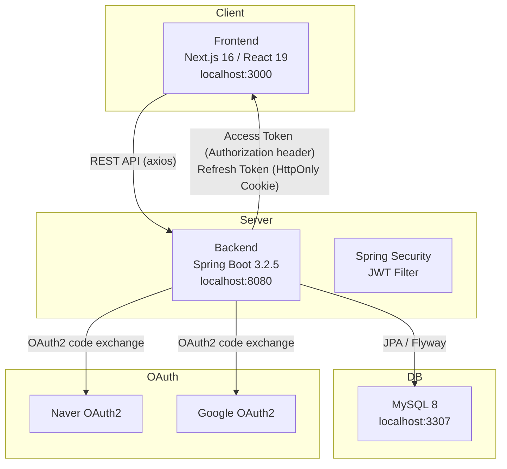

# 02 — System Architecture

---

## 전체 구성도



---

## Frontend 레이어 구조

```
frontend/src/
├── app/                  Next.js App Router 페이지
│   ├── auth/callback/    OAuth 콜백 처리
│   ├── checklist/new/    체크리스트 작성
│   ├── login/            로그인
│   └── report/           매물 비교 리포트
├── features/             도메인별 기능 모듈
│   └── checklist/        체크리스트 (components + hooks)
├── components/           공통 UI 컴포넌트
│   └── ui/               Button, Modal, Skeleton 등
├── services/             API 호출 레이어 (axios)
├── store/                Zustand 전역 상태
├── types/                TypeScript 타입 정의
└── lib/                  유틸리티
```

---

## Backend 레이어 구조

```
backend/src/main/java/com/room/backend/
├── api/                  API 레이어 (Controller / Service / DTO)
│   └── auth/             인증 도메인 API
├── domain/               도메인 엔티티 & 리포지토리
│   └── user/             User, RefreshToken
└── global/               공통 인프라
    ├── auth/
    │   ├── jwt/          JWT 생성·검증·필터
    │   ├── oauth/        OAuth2 클라이언트 (Naver, Google)
    │   └── cookie/       쿠키 헬퍼
    ├── common/
    │   ├── entity/       BaseEntity (createdAt, updatedAt, softDelete)
    │   ├── exception/    공통 예외 처리
    │   └── response/     ApiResponse 래퍼
    └── config/           SecurityConfig, AppPathProperties
```

---

## 인증 흐름 (OAuth2 + JWT)

```
FE                        BE                      OAuth Provider
 │                         │                            │
 │── GET /auth/oauth2/{p} ─▶│                            │
 │                         │── buildAuthorizeUrl ────────▶│
 │◀─ authorizeUrl ─────────│                            │
 │                         │                            │
 │── redirect to provider ──────────────────────────────▶│
 │                         │                            │
 │◀── redirect with code ──────────────────────────────│
 │                         │                            │
 │── GET /auth/oauth2/{p}/callback?code=... ───────────▶│
 │                         │── token exchange ──────────▶│
 │                         │◀─ user info ───────────────│
 │◀── Authorization: Bearer {accessToken}               │
 │    Set-Cookie: refresh_token (HttpOnly)              │
```

---

_Last updated: 2026-04-29_
