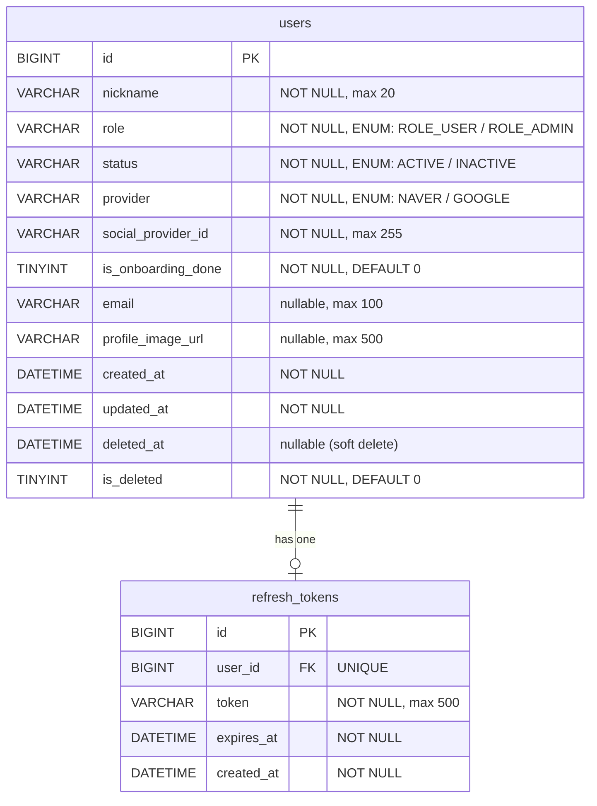

# 03 — ERD (Entity Relationship Diagram)

> Auto-generated from `backend/domain/**/entity/` + `db/migration/V*.sql`  
> Update via `/swyp-docs erd` when entity changes.

---

## Mermaid ER Diagram

---

## 테이블 상세

### `users`

| 컬럼 | 타입 | 제약 | 설명 |
|---|---|---|---|
| id | BIGINT | PK, AUTO_INCREMENT | 사용자 ID |
| nickname | VARCHAR(20) | NOT NULL | 닉네임 |
| role | VARCHAR(20) | NOT NULL | `ROLE_USER` / `ROLE_ADMIN` |
| status | VARCHAR(20) | NOT NULL | `ACTIVE` / `INACTIVE` |
| provider | VARCHAR(20) | NOT NULL | `NAVER` / `GOOGLE` |
| social_provider_id | VARCHAR(255) | NOT NULL | OAuth 제공자 고유 ID |
| is_onboarding_done | TINYINT(1) | NOT NULL, DEFAULT 0 | 온보딩 완료 여부 |
| email | VARCHAR(100) | nullable | 이메일 (V3에서 nullable 변경) |
| profile_image_url | VARCHAR(500) | nullable | 프로필 이미지 URL (V4 추가) |
| created_at | DATETIME(6) | NOT NULL | 생성일시 |
| updated_at | DATETIME(6) | NOT NULL | 수정일시 |
| deleted_at | DATETIME(6) | nullable | 소프트 삭제 일시 |
| is_deleted | TINYINT(1) | NOT NULL, DEFAULT 0 | 소프트 삭제 여부 |

### `refresh_tokens`

| 컬럼 | 타입 | 제약 | 설명 |
|---|---|---|---|
| id | BIGINT | PK, AUTO_INCREMENT | 토큰 ID |
| user_id | BIGINT | FK → users.id, UNIQUE | 사용자 ID (1:1) |
| token | VARCHAR(500) | NOT NULL | Refresh Token 값 |
| expires_at | DATETIME(6) | NOT NULL | 만료일시 |
| created_at | DATETIME(6) | NOT NULL | 발급일시 |

---

## Flyway 마이그레이션 이력

| 버전 | 파일 | 내용 |
|---|---|---|
| V1 | `V1__init_schema.sql` | users 테이블 초기 생성 |
| V2 | `V2__rename_user_id_and_add_refresh_tokens.sql` | user_id → id 컬럼 리네임 + refresh_tokens 테이블 추가 |
| V3 | `V3__make_email_nullable.sql` | email 컬럼 nullable 변경 |
| V4 | `V4__add_profile_image_url_to_users.sql` | profile_image_url 컬럼 추가 |

---

_Last updated: 2026-04-29_
